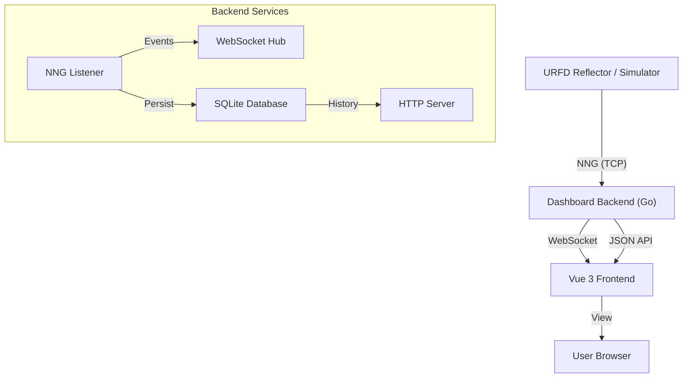

# Implementation Details

## Architecture

The URFD NNG Dashboard is a real-time monitoring solution for Universal Reflector servers, decoupling the dashboard from the core reflector logic using NNG (Nanomsg Next Gen).



## Components

### Backend (Go)

- **NNG Protocol**: Subscribes to event streams (`hearing`, `state`, etc.) from the reflector.
- **SQLite Store**: Persists hearing history and active sessions for durability.
- **WebSocket Hub**: Broadcasts real-time events to connected clients.
- **HTTP API**: Serves historical data and configuration.

### Frontend (Vue 3 + Tailwind)

- **Real-time Updates**: Reflects state changes instantly via WebSockets.
- **Responsive Design**: Full support for Mobile, Tablet, and Desktop.
- **Themes**: Dark/Light mode support.
- **Configurable Metadata**: Module descriptions defined in `config.yaml` overlay dynamic data.

## Configuration

The application is configured via `config.yaml`. A fully commented example is available in `examples/config.yaml`.

### Key Settings

- **Server**: Bind address (`:8080`), database path (`data/dashboard.db`).
- **Reflector**: NNG URL (`tcp://...`) and display name.
- **Logging**: Level, file output, and rotation settings.

## Deployment

### Docker

The application is containerized using a multi-stage build.

**Volume Mounts**:

- `/app/data`: Persist the SQLite database.
- `/app/config.yaml`: Mount your custom configuration.

### Docker Compose

A `docker-compose.yml` is provided for easy deployment.

```yaml
services:
  dashboard:
    image: urfd-dashboard
    ports:
      - "8080:8080"
    volumes:
      - dashboard-data:/app/data
      - ./config.yaml:/app/config.yaml:ro
```
