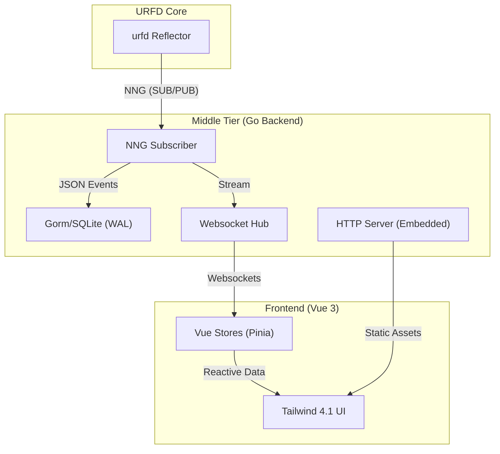

# URFD NNG Dashboard Project Plan

This document serves as the living project plan and architecture guide for the URFD NNG Dashboard.

## Overview

A modern, real-time dashboard for the URFD reflector system using Go, Vue 3, and NNG.

## Architecture

## Key Components

- **Backend**: Go 1.25.5, Gorm, modernc/sqlite, NNG.
- **Frontend**: Vue 3, Vite, Tailwind CSS 4.1, Bun.
- **CI/CD**: GitHub Actions, release-please, GoReleaser.
- **Deployment**: Docker Compose, Systemd (Deb/RPM via NFPM).

## Rules

- **TDD**: Write tests before implementation.
- **Linting**: golangci-lint v2.7.2+ in CI.
- **Theming**: System preference default, switchable Light/Dark.
